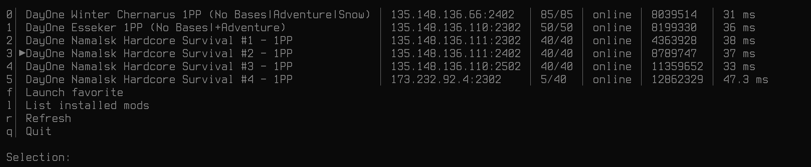

A GUI version of [DZTUI](https://github.com/aclist/dztui) for Linux. Used to list community server details and quick connect to preferred servers by staging mods and concatenating launch options automatically.  

**Setup and usage**
Refer to the [documentation](https://aclist.github.io/dzgui/dzgui.html)

